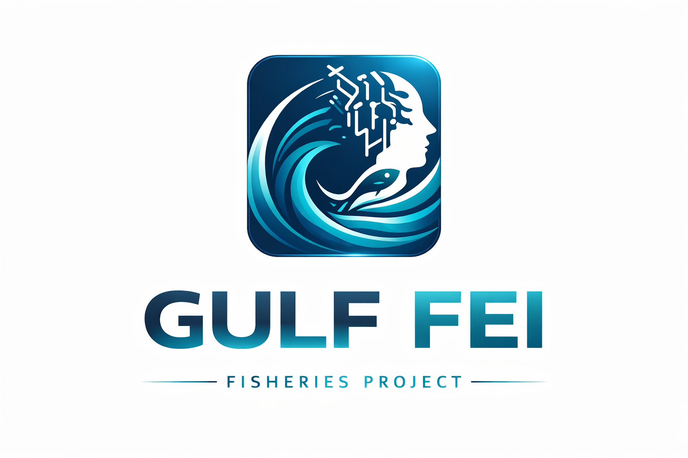

<div align="center">



# 🌊 Gulf FEI

### Perception & Discourse Intelligence for Gulf of Mexico Fisheries

**AI that listens to how the public perceives Gulf of Mexico fisheries.**

Gulf FEI mines real community discourse — blogs, online forums, YouTube, and podcasts — about
Gulf of Mexico fisheries and the Gulf of Mexico Fishery Management Council, and turns it into
grounded RAG answers and research-grade **Fuzzy Cognitive Maps (FCMs)** of the community's
perceived cause-and-effect.


</div>

---

## 📑 Table of contents

- [What it does](#-what-it-does)
- [Key features](#-key-features)
- [Architecture](#-architecture)
- [Project structure](#-project-structure)
- [Quick start](#-quick-start)
- [Vector store on Google Drive](#-vector-store-on-google-drive)
- [API reference](#-api-reference)
- [How the FCM is built](#-how-the-fcm-is-built)
- [Rebuilding the vector store](#-rebuilding-the-vector-store)
- [Troubleshooting](#-troubleshooting)
- [Tech stack](#-tech-stack)
- [Notes & limits](#-notes--limits)
- [License & data](#-license--data)

---

## ✨ What it does

Unlike a fisheries-*science* assistant, Gulf FEI is a **perception engine**. Its knowledge base is
built entirely from public voices, so it synthesises what anglers, commercial fishers, charter
captains, and coastal residents actually say — capturing viewpoints, consensus, disagreement, and
sentiment, and clearly separating **community opinion** from **established fact**.

Every query produces three things:

1. **A grounded perception answer** — RAG over the discourse corpus.
2. **A signed Fuzzy Cognitive Map** — a directed graph of perceived causal relationships
   (cause → effect, positive/negative, weighted).
3. **An adjacency matrix** of the FCM, downloadable as CSV / JSON.

You can also upload your own documents (or an adjacency matrix) to build an FCM, and run
**what-if scenario simulations** on any map.

---

## 🧠 Key features

| Area | Highlights |
|------|------------|
| **Perception RAG** | Adaptive, sentiment-aware answers grounded in retrieved discourse; distinguishes stakeholder groups; never passes opinion off as fact. |
| **Research-grade FCM** | Rule-based causal extraction with intensity-modulated weights, corroboration confidence, concept cleaning, lemma + fuzzy de-duplication, co-occurrence fallback, and 2-hop transitive inference. |
| **Evidence transparency** | Every causal edge traces back to the sentence(s) that produced it; the UI table is filterable by edge type (pattern / co-occurrence / inferred). |
| **Scenario simulation** | Kosko activation propagation — clamp "driver" concepts and watch the downstream effects. |
| **File upload** | Build an FCM from `.docx` / `.pdf` / `.txt` / `.md`, or load an adjacency-matrix `.csv` / `.xlsx` directly. |
| **Vector store on Drive** | One command downloads the large FAISS / parquet files from Google Drive (file IDs baked in). |
| **Polished UI** | Light dashboard; publication-quality FCM with community modules, node roles, betweenness sizing, and signed weighted edges. |

---

## 🏗️ Architecture

```
Public discourse (blogs, forums, YouTube, podcasts)
        |  Research/ notebooks  ->  chunk + embed (BGE) + FAISS
        v
Google Drive  --(python download_vector_db.py)-->  vector_db/
                                                   |- index.faiss
                                                   |- vector_df.parquet
                                                   |- build_config.json
        |
        v
   FastAPI (main.py)
        |- VectorStoreLoader (src/vector_loader.py) -> FAISS retriever (cosine)
        |- RAG chain (src/rag.py, Groq Llama-3.3-70B)        -> answer
        |- CausalExtractor (FCM/) -> FCMGenerator (src/FCM.py) -> signed FCM + matrix
        v
   templates/index.html  (answer, relations, FCM, matrix)
```

**Embedding / index:** `BAAI/bge-small-en-v1.5` (384-dim, L2-normalised), FAISS `IndexFlatIP`
(exact cosine), **499,789 chunks** from **3,224 documents**.

---

## 📁 Project structure

```
GULF-FEI/
├── main.py                  # FastAPI app: endpoints, startup, macOS guards
├── run_server.py            # Pre-flight checks + uvicorn launcher (alternative)
├── download_vector_db.py    # Downloads the vector store from Google Drive
├── test.py                  # Smoke test
├── test_groq.py             # Groq connectivity check
├── requirements.txt
├── .env                     # GROQ_API_KEY (git-ignored, you create it)
│
├── src/
│   ├── rag.py               # Perception RAG chain (Groq + LangChain LCEL)
│   ├── vector_loader.py     # Loads FAISS index + parquet metadata
│   └── FCM.py               # FCMGenerator: build FCM + render the graph
│
├── FCM/
│   ├── extractor.py         # CausalExtractor: causal patterns, weights, cleaning
│   ├── fcm_graph.py         # FCMGraphBuilder: adjacency matrix + network export
│   ├── categorizer.py       # Maps concepts to thematic modules
│   ├── simulator.py         # FCMSimulator: Kosko scenario propagation
│   ├── clustering.py        # Semantic clustering of relations
│   ├── retrieval.py         # Similarity / TF-IDF retrieval helpers
│   ├── answering.py         # Answer assembly helpers
│   ├── file_parser.py       # Parse uploaded docs and adjacency matrices
│   ├── pyfcm_adapter.py     # PyFCM simulation adapter
│   ├── schemas.py           # Pydantic models (Edge, FCMMap, ...)
│   ├── main.py              # FCM module helpers
│   └── docs/                # FCM methodology + walkthrough notebook
│
├── templates/               # index.html, new_index.html, result.html
├── static/                  # generated FCM PNGs (git-ignored)
├── logo/                    # brand logo
├── vector_db/               # FAISS index + parquet + build_config.json
└── Research/                # data-pipeline notebooks
```

---

## 🚀 Quick start

**Prerequisites:** Python 3.11+ and a Groq API key (https://console.groq.com).

**1. Clone and enter the project**

```bash
git clone https://github.com/mahiwasim/GULF-FEI.git
cd GULF-FEI
```

**2. Create and activate a virtual environment**

```bash
python -m venv venv
source venv/bin/activate
```

On Windows, activate with `venv\Scripts\activate` instead.

**3. Install dependencies**

```bash
pip install -r requirements.txt
```

**4. Add your Groq API key**

Create a `.env` file in the project root containing:

```env
GROQ_API_KEY=your_key_here
```

**5. Download the vector store** (~840 MB, one time)

```bash
python download_vector_db.py
```

**6. Run the app**

```bash
uvicorn main:app --reload
```

Open **http://localhost:8000**. The first startup loads ~500k vectors into memory (about a minute);
`GET /health` returns `{"vector_store_loaded": true}` once ready.

An alternative launcher with extra pre-flight checks is also available:

```bash
python run_server.py
```

---

## ☁️ Vector store on Google Drive

The vector files are ~1.6 GB total — over GitHub's 100 MB limit — so they live on Google Drive and
are downloaded with one command. The Drive file IDs are already baked into `download_vector_db.py`,
so no configuration is needed.

Only the two runtime files are fetched (the 732 MB `vectors.npy` is skipped — it is only for
rebuilding the index):

| File | Size | In git? | Downloaded? |
|------|------|---------|-------------|
| `index.faiss` | ~735 MB | No (git-ignored) | Yes |
| `vector_df.parquet` | ~104 MB | No (git-ignored) | Yes |
| `vectors.npy` | ~732 MB | No (git-ignored) | No (set `GDRIVE_VECTORS_NPY_ID` to fetch) |
| `build_config.json` | <1 KB | Yes | — |

The downloader skips any file already present, so it is safe to re-run:

```bash
python download_vector_db.py
```

**Using your own copy (optional).** If you rebuild the store and host it yourself, override the
defaults in `.env`:

```env
GDRIVE_INDEX_FAISS_ID=your_index_faiss_id
GDRIVE_VECTOR_DF_ID=your_vector_df_parquet_id
# GDRIVE_VECTORS_NPY_ID=your_vectors_npy_id     # optional, rebuild only
# GDRIVE_VECTOR_DB_FOLDER_ID=your_folder_id     # or resolve all IDs from one folder
```

---

## 🔌 API reference

| Method | Endpoint | Purpose |
|--------|----------|---------|
| `GET`  | `/` | The web app (perception query + upload UI). |
| `GET`  | `/health` | Liveness + `vector_store_loaded` flag. |
| `POST` | `/query` | Form (`query`, `max_edges`) → answer + FCM + matrix. |
| `POST` | `/api/query` | JSON (`{"question": "...", "relation_length": 10}`) → same payload. |
| `POST` | `/upload-files` | Multipart files → FCM from documents / adjacency matrices. |
| `GET`  | `/fcm-concepts` | Concepts of the most recent FCM (for the simulator). |
| `POST` | `/simulate-fcm` | Kosko scenario simulation on the cached FCM. |

**Example — JSON query**

```bash
curl -X POST http://localhost:8000/api/query \
  -H "Content-Type: application/json" \
  -d '{"question": "How does the Gulf community perceive red snapper season limits?", "relation_length": 12}'
```

**Example — scenario simulation**

```bash
curl -X POST http://localhost:8000/simulate-fcm \
  -H "Content-Type: application/json" \
  -d '{"activations": {"Red Tide": 1.0}, "steps": 30, "squash": "sigmoid", "clamp_drivers": true}'
```

---

## 🔬 How the FCM is built

```
sentences -> causal patterns -> weight modulation -> concept cleaning
   -> consolidation -> corroboration -> co-occurrence + 2-hop inference -> visualisation
```

1. **Causal patterns** — a registry of signed templates (`X increases Y`, `X reduces Y`,
   `Y due to X`, passive forms) assigns a base weight and polarity.
2. **Intensity / hedging modulation** — emphatic adverbs scale a relation up, hedged language scales
   it down, clamped to (-0.98, +0.98).
3. **Concept cleaning** — gates reject clause fragments, vague singles, and verb phrases.
4. **Consolidation** — lemma keys + fuzzy matching merge near-duplicates; bidirectional
   same-polarity edges are de-duplicated.
5. **Corroboration confidence** — relations stated across multiple sentences gain confidence.
6. **Co-occurrence fallback + 2-hop transitive inference** densify the graph; inferred edges are
   visually distinct and filterable.
7. **Visualisation** (`src/FCM.py`) — Kamada-Kawai layout, betweenness-scaled nodes, modularity
   colour modules, role rings, and signed weighted edges.

---

## 📊 Rebuilding the vector store

The corpus is built in `Research/BUILD_RAG_PIPELINE.ipynb`:

```
metadata + scraped_text -> join on Document_ID -> chunk (800 chars, 120 overlap)
-> embed (BAAI/bge-small-en-v1.5, normalized) -> FAISS IndexFlatIP
-> save index.faiss + vector_df.parquet + vectors.npy + build_config.json
```

`src/vector_loader.py` reads the model name from `build_config.json`, so the query encoder always
matches the index. After rebuilding, re-upload `index.faiss` + `vector_df.parquet` to Drive.

---

## 🛠️ Troubleshooting

| Symptom | Fix |
|---------|-----|
| `GROQ_API_KEY not set` | Create a `.env` file with `GROQ_API_KEY=your_key_here`. |
| `Vector store not found` on startup | Run `python download_vector_db.py`, then start the app. |
| Download fails / `no Drive ID could be resolved` | Ensure the Drive folder is shared "Anyone with the link", or set `GDRIVE_*` IDs in `.env`. |
| `Unable to find a usable engine ... pyarrow` | `pip install -r requirements.txt` (pyarrow reads the parquet). |
| `/health` shows `vector_store_loaded: false` | Store still loading, or not downloaded — run the downloader and check the logs. |
| Query hangs on macOS | Already handled: `main.py` sets `TOKENIZERS_PARALLELISM=false` to avoid the tokenizer fork-deadlock. |
| Out of memory at startup | The index loads fully into RAM. Use a machine with more memory or a smaller corpus. |

---

## ⚙️ Tech stack

FastAPI, Uvicorn, LangChain (LCEL), Groq (Llama-3.3-70B), FAISS, sentence-transformers (BGE),
pandas + pyarrow, gdown, NetworkX, Matplotlib, Jinja2.

---

## ⚠️ Notes & limits

- The whole corpus loads into memory at startup (exact FAISS search) — great accuracy; plan memory
  for large deployments.
- The scenario simulator caches a single most-recent FCM (single-user semantics).
- Answers reflect public perception, which may diverge from the scientific record by design.

---

## 📄 License & data

Provided for research and educational use. The source discourse (blogs, forums, YouTube, podcasts)
belongs to its original authors — Gulf FEI stores only derived embeddings and metadata for analysis.
Add a license file (e.g. `LICENSE`, MIT) before publishing publicly.
